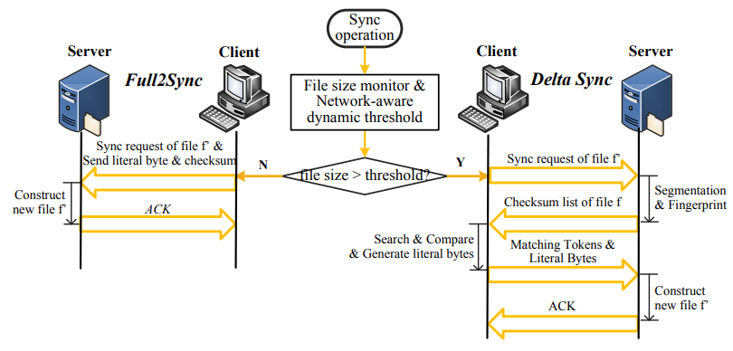
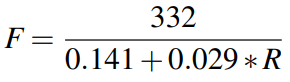
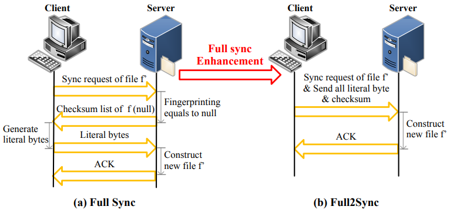

## PandaSync: 网络和工作负载感知的混合云同步优化

> PandaSync: Network and Workload aware Hybrid Cloud Sync Optimization

**作者：** Suzhen Wu, Longquan Liu, Hong Jiang, Hao Che, Bo Mao

**时间：** 2019

**提出问题：**  
随着越来越多的数据被转移到云端，通过有效的云同步来确保数据的一致性非常重要。现有的云同步方案要么是delta同步，要么是完全同步：
- delta(差分)同步即只发送文件的更新部分，但对小文件来说会产生删除重复数据时的高额计算开销；
- 完全同步即发送完整的文件来避免删除重复数据，但会浪费网络带宽，并且由于在网络上为大文件传输大量冗余数据导致同步时间的延长。

**提出方法：**  
提出了一种混合云同步方案PandaSync，它会根据文件大小及网络状况动态地结合增量同步和完全同步。
且为了进一步提高小文件同步的性能，提出Full2Sync优化方案，该方案将数据同步请求和文件发送请求合并在一起发送，以此减少客户端和云服务器之间的网络往返次数。

**问题详情：**  
增量同步方案中，只同步文件的改变部分能够显著减少网络传输，所以增量同步成为近年来的研究热点。
但是，<mark>增量同步方案在关键I/O路径上会产生大量的**计算开销**，这也是现有研究**试图解决的关键问题**</mark>。  
- 为什么着重小文件？  
研究表明，小文件在企业和云环境的工作负载中占据主导地位，也占所有用户操作的80%以上，所以对小文件的增量同步至关重要。
本文作者研究发现，即使在增量很小的情况下，采用增量同步方案来同步小文件，仍然会有很高的计算量和网络开销，
比如，在10KB文件中只更新了3KB内容的情况下，采用固定大小分块的增量同步方案会使同步延迟比完全同步方案增加20%以上。
此外，对于小文件同步，网络延迟占同步延迟的50%以上。所以，可以归纳为，小文件占比很重且小文件的网络传输有待优化。
- 其它文献研究的缺陷？  
比如QuickSync、DeltaCFS、WebDelta都是基于单一的增量同步方案，缺乏将完全同步和增量同步结合起来的同步方案，
不能根据网络性能和文件特点进行同步。
- 作者发现？  
无论是完全同步还是增量同步，网络传输的耗时在小文件同步的总同步时间中都占据着占主导地位，这意味着可以通过减少客户端和云服务器之间的网络交互时间来优化网络传输，从而加速同步的时间。
此外，随着文件大小的增加，增量同步的计算开销会大于其网络传输的开销，尤其是对基于CDC内容定义分块的增量同步而言更加明显。因此：
  - 对于小文件同步，采取完全同步方案明显要优于增量同步方案；
  - 网络传输占据了小文件同步的大部分时间，即客户端和服务器之间的往返时间大大超过了网络的数据传输时间，这也是可以优化的点。
  > 以上这两个问题，之前的研究还未解决。 
  
在存储系统设计中还必须考虑应用产生的工作负载的特点。比如，I/O请求大小的分布是工作负载特性的一个重要因素，因为了解I/O请求的大小可以直接帮助对某些参数进行适当的配置。
但现有研究集中在增量同步方案的计算开销，但本文研究证明增量同步对小文件同步而言并不有效，相反，应对小文件采取完全同步方案。  

> 综上所述，该文的创新点/研究点在于：
> 1. 设计的算法能动态切换完全同步和增量同步，特别是和别的文献不同的是，该文首次对小文件采取完全同步方案。
> 2. 设计的算法考虑到了利用工作负载特点和网络特点。
> 3. 将小文件的同步请求和发送文件请求合并为一个请求，以减少网络通讯的时间。

**方法详情：**  
- 总思想：  
为了解决云存储中的**同步效率**问题，提出一种混合数据同步方法PandaSync，它在完全同步和增量同步之间动态切换，能很好适应网络性能和工作负载特性的变化。
与现有的同步方法不同的是，<mark>PandaSync对小文件采用完全同步，对大文件采用基于固定大小分块的增量同步</mark>，其中小文件和大文件之间的大小阈值是基于网络往返时间RTT。
通过利用工作负载特征和网络条件，充分利用了完全同步和增量同步方案的优点并减轻了它们的缺点。
同时，针对小文件同步进行了优化，PandaSync中的Full2Sync可以将小文件的同步请求和发送请求合并为一个请求，进一步减少客户端和云服务器之间的网络往返交互次数。  

**方法设计：**  
PandaSync总体架构如下图所示：  

  

PandaSync由三个功能模块组成：文件大小监视器、网络动态感知阈值器和同步方案选择器。  
- <u>文件大小监视器负责</u>：获取待同步文件大小的信息，并计算校验和，以便之后的一致性检查；
- <u>网络动态感知阈值器负责</u>：根据网络性能确定区分大、小文件的动态阈值；
   网络感知动态阈值模块需要通过"ping"命令自适应地跟踪客户端的网络RTT值。一旦获得网络RTT值，就能确定相应的大小阈值，并应用于后续的同步文件。
- <u>同步方案选择器负责</u>：收集发送到这里的信息，然后在完全同步和增量同步之间进行选择，其中，Full2Sync是对小文件的完全同步方法的一种优化。
  在文件准备同步时，先获取该文件大小，与网络动态感知阈值进行比较，若大于阈值，则进行增量同步，否则进行改进的Full2Sync的完全同步，阈值高度依赖于网络性能。  

网络动态感知阈值定义如下：  
首先，通过公式（1）和（2）分别定义固定分块的增量同步时间、Full2Sync的完全同步时间。其中，R表示RTT，F表示同步文件大小，
其余参数，如处理延迟、查询延迟是作者从实验中得到的：  

  

再联立两者，得到网络动态阈值，即根据RTT确定出区分大小文件的阈值：  

  

---
接下来，是对小文件的同步优化。  
提出Full2Sync的小文件完全同步方法，考虑到同步性能仍依赖于网络延迟，所以作者将同步请求和同步数据合并在一起，这样就减少客户端和服务器的交互次数，最大限度地利用网络带宽。  

---
与现有的优化相比，PandaSync根据文件的特性和网络性能，动态地、明智地在完全同步方案和增量同步方案之间切换。
此外，由于使用改进的Full2Sync，PandaSync进一步优化了小文件同步工作流程，从而大大降低了同步延迟，即更短的同步时延。

**数据集：**  
PandaSync原型是建立在Rsync 3.1.3版本之上的。它在客户端增加和修改了2945个LOC，在服务器端增加了1152个LOC。  
PandaSync原型的源代码可在：https://github.com/LongquanLiu/PandaSync 上访问。

**未来研究：**
1. 首先，数据冗余特性是决定是否对大文件应用增量同步的重要因素。
   然而，对于一个特定的文件来说，数据冗余特性是很难测量或提前预测的。
   作者将进一步研究如何通过利用工作负载特性来减少大文件的同步延迟。

**补充知识：**  
1. 数据同步是云存储服务的主要和关键技术，允许客户端自动使本地文件与存储在远程云数据中心的文件一致。
   从云存储提供商的角度来看，较短的同步延迟意味着更高的系统吞吐量，能直接提高数据中心的性能和成本效率，
   因此，**同步性能**被认为是云存储服务最重要的因素，并直接影响系统的一致性和吞吐量。
2. 云同步是指，使多个设备/用户中的文件副本保持最新并在整个云中保持一致的过程。对于云同步，用户首先设置一个基于云的文件夹，将所需文件复制到该文件夹；
该文件夹使多个用户可以在他们使用的任何设备上通过云界面访问文件。
当用户更新设备上的文件时，修改后的文件会自动与云文件夹以及其他设备/用户上的相应文件夹进行同步。
3. 经典的增量同步算法有两种：
   - 固定大小分块
   - 内容定义分块 (CDC)
4. 为了更好地理解性能结果，同步时间被分解为：花在客户端、网络传输和服务器端的时间。
5. 网络往返时延RTT：指数据包从传输到网络再到发送方收到数据包的确认的时间。例如，数据包的正向和反向的路径延迟之和。
   网络RTT会受到许多因素的影响，如网络排队和路径长度，这些因素可能会随着时间的推移而变化。

---
