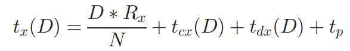

## PandaSync: 网络和工作负载感知的混合云同步优化

> PandaSync: Network and Workload aware Hybrid Cloud Sync Optimization

**作者：** Suzhen Wu, Longquan Liu, Hong Jiang, Hao Che, Bo Mao

**时间：** 2019

**提出问题：**  
随着越来越多的数据被转移到云端，通过有效的云同步来确保数据的一致性非常重要。现有的云同步方案要么是delta同步，要么是完全同步：
- delta(差分)同步即只发送文件的更新部分，但对小文件来说会产生删除重复数据时的高额计算开销；
- 完全同步即发送完整的文件来避免删除重复数据，但会浪费网络带宽，并且由于在网络上为大文件传输大量冗余数据导致同步时间的延长。

**提出方法：**  
提出了一种混合云同步方案PandaSync，它会根据文件大小及网络状况动态地结合增量同步和完全同步。
且为了进一步提高小文件同步的性能，提出Full2Sync优化方案，该方案将数据同步请求和文件发送请求合并在一起发送，以此减少客户端和云服务器之间的网络往返次数。

**问题详情：**  
增量同步方案中，只同步文件的改变部分能够显著减少网络传输，所以增量同步成为近年来的研究热点。
但是，<mark>增量同步方案在关键I/O路径上会产生大量的**计算开销**，这也是现有研究**试图解决的关键问题**</mark>。  
- 为什么着重小文件？  
研究表明，小文件在企业和云环境的工作负载中占据主导地位，也占所有用户操作的80%以上，所以对小文件的增量同步至关重要。
本文作者研究发现，即使在增量很小的情况下，采用增量同步方案来同步小文件，仍然会有很高的计算量和网络开销，
比如，在10KB文件中只更新了3KB内容的情况下，采用固定大小分块的增量同步方案会使同步延迟比完全同步方案增加20%以上。
此外，对于小文件同步，网络延迟占同步延迟的50%以上。所以，可以归纳为，小文件占比很重且小文件的网络传输有待优化。
- 其它文献研究的缺陷？  
比如QuickSync、DeltaCFS、WebDelta都是基于单一的增量同步方案，缺乏将完全同步和增量同步结合起来的同步方案，
不能根据网络性能和文件特点进行同步。
- 作者发现？  
无论是完全同步还是增量同步，网络传输的耗时在小文件同步的总同步时间中都占据着占主导地位，这意味着可以通过减少客户端和云服务器之间的网络交互时间来优化网络传输，从而加速同步的时间。
此外，随着文件大小的增加，增量同步的计算开销会大于其网络传输的开销，尤其是对基于CDC内容定义分块的增量同步而言更加明显。因此：
  - 对于小文件同步，采取完全同步方案明显要优于增量同步方案；
  - 网络传输占据了小文件同步的大部分时间，即客户端和服务器之间的往返时间大大超过了网络的数据传输时间，这也是可以优化的点。
  > 以上这两个问题，之前的研究还未解决。 
  
在存储系统设计中还必须考虑应用产生的工作负载的特点。比如，I/O请求大小的分布是工作负载特性的一个重要因素，因为了解I/O请求的大小可以直接帮助对某些参数进行适当的配置。
但现有研究集中在增量同步方案的计算开销，但本文研究证明增量同步对小文件同步而言并不有效，相反，应对小文件采取完全同步方案。  

> 综上所述，该文的创新点/研究点在于：
> 1. 设计的算法能动态切换完全同步和增量同步，特别是和别的文献不同的是，该文首次对小文件采取完全同步方案。
> 2. 设计的算法考虑到了利用工作负载特点和网络特点。
> 3. 将小文件的同步请求和发送文件请求合并为一个请求，以减少网络通讯的时间。

**方法详情：**  
- 总思想：  
为了解决云存储中的**同步效率**问题，提出一种混合数据同步方法PandaSync，它在完全同步和增量同步之间动态切换，能很好适应网络性能和工作负载特性的变化。
与现有的同步方法不同的是，<mark>PandaSync对小文件采用完全同步，对大文件采用基于固定大小分块的增量同步</mark>，其中小文件和大文件之间的大小阈值是基于网络往返时间RTT。
通过利用工作负载特征和网络条件，充分利用了完全同步和增量同步方案的优点并减轻了它们的缺点。
同时，针对小文件同步进行了优化，PandaSync中的Full2Sync可以将小文件的同步请求和发送请求合并为一个请求，进一步减少客户端和云服务器之间的网络往返交互次数。  

**方法设计：**  
PandaSync总体架构如下图所示：  

  

PandaSync由三个功能模块组成：文件大小监视器、网络动态感知阈值器和同步方案选择器。  
- <u>文件大小监视器负责</u>：获取待同步文件大小的信息，并计算校验和，以便之后的一致性检查；
- <u>网络动态感知阈值器负责</u>：根据网络性能确定区分大、小文件的动态阈值；
   网络感知动态阈值模块需要通过"ping"命令自适应地跟踪客户端的网络RTT值。一旦获得网络RTT值，就能确定相应的大小阈值，并应用于后续的同步文件。
- <u>同步方案选择器负责</u>：收集发送到这里的信息，然后在完全同步和增量同步之间进行选择，其中，Full2Sync是对小文件的完全同步方法的一种优化。
  在文件准备同步时，先获取该文件大小，与网络动态感知阈值进行比较，若大于阈值，则进行增量同步，否则进行改进的Full2Sync的完全同步，阈值高度依赖于网络性能。  

网络动态感知阈值定义如下：  
首先，通过公式（1）和（2）分别定义固定分块的增量同步时间、Full2Sync的完全同步时间。其中，R表示RTT，F表示同步文件大小，
其余参数，如处理延迟、查询延迟是作者从实验中得到的：  

  

再联立两者，得到网络动态阈值，即根据RTT确定出区分大小文件的阈值：  

  

---
接下来，是对小文件的同步优化。  
提出Full2Sync的小文件完全同步方法，考虑到同步性能仍依赖于网络延迟，所以作者将同步请求和同步数据合并在一起，这样就减少客户端和服务器的交互次数，最大限度地利用网络带宽。  

---
与现有的优化相比，PandaSync根据文件的特性和网络性能，动态地、明智地在完全同步方案和增量同步方案之间切换。
此外，由于使用改进的Full2Sync，PandaSync进一步优化了小文件同步工作流程，从而大大降低了同步延迟，即更短的同步时延。

**数据集：**  
PandaSync原型是建立在Rsync 3.1.3版本之上的。它在客户端增加和修改了2945个LOC，在服务器端增加了1152个LOC。  
PandaSync原型的源代码可在：https://github.com/LongquanLiu/PandaSync 上访问。

**未来研究：**
1. 首先，数据冗余特性是决定是否对大文件应用增量同步的重要因素。
   然而，对于一个特定的文件来说，数据冗余特性是很难测量或提前预测的。
   作者将进一步研究如何通过利用工作负载特性来减少大文件的同步延迟。

**补充知识：**  
1. 数据同步是云存储服务的主要和关键技术，允许客户端自动使本地文件与存储在远程云数据中心的文件一致。
   从云存储提供商的角度来看，较短的同步延迟意味着更高的系统吞吐量，能直接提高数据中心的性能和成本效率，
   因此，**同步性能**被认为是云存储服务最重要的因素，并直接影响系统的一致性和吞吐量。
2. 云同步是指，使多个设备/用户中的文件副本保持最新并在整个云中保持一致的过程。对于云同步，用户首先设置一个基于云的文件夹，将所需文件复制到该文件夹；
该文件夹使多个用户可以在他们使用的任何设备上通过云界面访问文件。
当用户更新设备上的文件时，修改后的文件会自动与云文件夹以及其他设备/用户上的相应文件夹进行同步。
3. 经典的增量同步算法有两种：
   - 固定大小分块
   - 内容定义分块 (CDC)
4. 为了更好地理解性能结果，同步时间被分解为：花在客户端、网络传输和服务器端的时间。
5. 网络往返时延RTT：指数据包从传输到网络再到发送方收到数据包的确认的时间。例如，数据包的正向和反向的路径延迟之和。
   网络RTT会受到许多因素的影响，如网络排队和路径长度，这些因素可能会随着时间的推移而变化。

---

## NetSync: 基于云存储服务的网络自适应和重复数据删除触发的增量同步方法

> NetSync: A Network Adaptive and Deduplication-Inspired Delta Synchronization Approach for Cloud Storage Services

**作者：** Wen Xia, Can Wei, Zhenhua Li, Xuan Wang, and Xiangyu Zou

**时间：** 2022

**提出问题：**  
1. 前人的研究，如DeltaCFS、PandaSync和WebR2sync+，虽然在各个方面改进了rsync，但他们都是基于rsync的，而rsync使用逐字节滑动窗口的块匹配过程可能非常耗时，尤其是当文件在高带宽云存储系统中越来越大时。
2. 传统的rsync同步难以满足即将到来的高带宽的云存储服务，这些服务需要轻量级的增量同步，去支持大文件同步。
3. 传统的rsync在同步过程中采用了固定的分块和压缩方法，使得它无法满足各种网络环境的服务。
4. 网络基础设施的进步使得目前的增量同步更难满足云存储的需求，因为客户端网络带宽的范围本来就比较大，而云端托管的文件尺寸也比较大，这是不可避免的挑战。  

**提出方法：**  
作者提出一种NetSync方法， 这是一种基于网络自适应的、CDC的、轻量级的增量同步方法。与最先进的增量同步方法相比，NetSync方法的计算开销和协议（元数据）开销更少。
NetSync可以针对不同的网络条件选择适当的压缩和分块策略。  
NetSync的关键思想是：   
（1）提出FastFP的<u>**快速**</u>弱散列来替换rsync中原本的Adler32，来简化弱散列块匹配过程，FastFP是基于CDC的滚动散列。  
（2）通过利用重复数据消除局部性和弱/强散列属性，重新设计增量同步协议；  
（3）根据当前网络条件自适应选择分块的参数和压缩方法，以最小化同步时间。  
与最先进的基于rsync的WebR2sync+方法和基于重复数据删除的方法相比，NetSync执行速度快2-10倍，支持的客户端数量多30%-80%

**问题详情：**  
1. 作者研究发现，减少<u>通信量</u>和<u>计算开销</u>，并在同步过程中充分利用当前<u>网络带宽</u>，仍然是增量同步需要解决的重要挑战。
2. rsync方法由于采用字节比较和哈希计算，会产生高额的计算开销，严重限制了它在**资源有限的客户端**的适用性，特别是当增量同步大文件时，计算开销特别大。
   因此，作者专注于为资源受限的客户端系统提供一种轻量级的、可移植的增量同步方法，通过手机、物联网设备等的Web浏览器进行同步。
3. 基于rsync同步的原始通信协议，对于基于CDC的方法来说并不高效，强散列计算和一些不匹配块的网络流量是不必要的。
4. 通用设计的配置对一般情况来说可能是次优的，需要根据网络状态来选择不同的配置。

**方法详情：**  
作者主要关注同步方法的两个最重要的指标：同步性能和灵活性。
- 同步性能：抛弃rsync中耗时的逐字节滑动窗口的块匹配，而是通过引入FastCDC技术，减少计算开销，提高同步性能。
- 灵活性：合理的做法是重新设计通信协议，根网络状况相应地改变同步配置，而不是在任何网络条件下使用不变的配置。
  它的挑战在于：1、在不影响同步的情况下监控网络状况；2、选择最佳的分块粒度和压缩方法，以尽量减少整体同步时间。此外，作者的实现是基于网络浏览器（最普遍的且独立于操作系统的访问），以获得更好的平台适应性。

> 研究点：NetSync是第一次尝试将<u>**CDC技术**</u>与<u>**传统的rsync模型**</u>相结合，以便在客户端受到资源限制时有效地同步数据，即在客户端没有本地缓冲区和足够的计算能力来执行类似rsync的增量同步协议。  

首先，在rsync中引入内容定义分块技术（即FastCDC），以匹配更多相同的内容并减少网络流量。
  同时，利用分块过程为分块生成弱散列值，称为FastFP，用FastFP取代rsync中使用的Adler32来生成弱指纹，来抵消了引入CDC所造成的的额外计算开销。  
其次，重新设计通信协议，减少计算开销和网络流量。  
（1）首先检查弱散列，然后计算并匹配弱散列匹配的块的强散列，以减少对不匹配的块的大部分不必要的强散列计算（减少计算开销）； 
（2）将连续的弱散列匹配的块合并成一个大块，以减少NetSync中网络交互的Match Token的大小（减少网络流量）。  

接着，通过网络自适应设计使同步时间最小化：  
（1）网络自适应压缩：根据网络感知模块得到的当前网络状况选择合适的压缩器进行压缩后传输；  
（2）网络自适应分块：根据当前网络状况改变CDC进程的分块粒度，网络好则分块粒度大，充分利用CDC的潜力和当前网络资源，从而使同步时间最小化。  

**方法设计：**  
NetSync的总体架构如下图所示：  

- Chunker。
  分块器，客户端和服务器文件将首先被FastCDC分成若干块，以便将来进行重复检测。
- 弱/强散列。
  该模块已被嵌入到chunker和matcher中。在该模块中，两级哈希值（即弱/强散列）被计算出来，用于检查重复的块。
  弱散列值快速且计算开销低，用于快速检查潜在的重复块，一旦识别出可能重复的块，再由强散列值进一步确认，以避免散列碰撞。
  否则，如果弱散列不匹配，则该块被标记为不重复的，就跳过强散列值。注意，WebR2sync+中原始使用的强哈希SipHash在NetSync中出于密码学考虑替换成SHA-1。
- matcher（哈希匹配）。
  在NetSync中，块的弱哈希值（即FastFP），将被比较以找到服务器上可能重复的块，再用强哈希值在客户端进一步确认。只有经那些强哈希值（即SHA-1）计算后仍然匹配的块才会被视为重复的块。
  否则，它们将被标记为新的块（即增量数据），并发送到服务器。
- 通信协议。
  该模块负责NetSync中客户端和服务器之间的通信。用于检查文件的弱哈希值和强哈希值，并最终传输增量数据进行同步。
- 网络自适应选择器。
  该模块负责在NetSync中选择最佳配置（即最佳的压缩器和分块颗粒度）。用于定期探测网络状况（网络监控器），并设置服务，通过选择最佳的压缩选择器和分块选择器来尽可能的优化同步性能。
---
一般工作流程概述（结合下图）：  

1. 首先，网络监控器探测网络状况并设置同步过程以获得最佳性能。
2. 开始同步过程，客户端的chunker通过FastCDC将客户端修改后的文件分成若干个块，并计算它们的弱指纹（即FastFP），并将弱指纹和各块的索引打包成Checksum List发送到服务器。
3. 服务器端的chunker以同样的方式分割服务器上的原文件。
4. 服务器端收到客户端发送来的Checksum List，就可以通过服务器端的matcher列出客户端和服务器端文件之间的弱哈希匹配的块（即可能的重复块），并将弱哈希匹配块的索引和该块的强哈希值（SHA-1）发送给客户端。
5. 客户端matcher检查这些块的强哈希值后，记录<u>重复</u>块的ID，通过patcher将<u>非重复</u>的块连同它们的索引，形成增量字节，并打包成Patch Tokens发送到服务器。
6. 最终，服务器端patcher整合重复和不重复的块的信息，在服务器端恢复客户端的文件，然后增量同步结束。

---
接下来详细讲述细节：  
1. FastFP：FastCDC中高效的弱哈希值。
2. 通信协议：降低不匹配块的强哈希计算开销和元数据传输开销。  
   作者研究发现，NetSync原型中，一旦弱哈希不匹配，则完全不用计算强哈希，所以原本的强哈希计算可以省略，上述的NetSync的一般流程就是新建的通信协议。
3. 减少网络流量：
   

     
   

   这是通过合并连续的几个弱哈希匹配块来实现的。
   在收到客户端的Checksum List之后，服务器端将服务器上的原文件f分割成若干块，并像客户端那样计算它们的弱哈希值。
   然后服务器将其文件f的弱哈希值与Checksum List中的弱哈希值进行比较。
   将连续的、匹配的弱哈希值块合并。之后，对它们整体进行强哈希计算，就会只有一个强哈希值将被计算出来，并被送回客户端供以后比较，换句话说，这种合并有助于减少元数据流量。  
   合并虽然可以帮助减少元数据流量。但可能发生合并碰撞，当"合并碰撞"发生时，合并将受到惩罚。
   此外，合并还有助于减少强散列（即SHA-1）的计算开销。
4. 网络自适应选择器：  
   由于网络带宽和同步参数之间的不匹配会降低数据同步的整体性能，所以有了该模块。下图是该模块：
   

   
   

   
   - 网络感知模块：
   

   
   

   简单来说，该模块是测试网络质量的，步骤如下：
   先生成一些随机数的数组，每个数组256kb或1MB；
   然后将数组以数据流的形式发送到服务器，等待接受返回的Acks，每隔200毫秒发送一次数组，
   这样，网络带宽将根据传输的数据量和传输时间计算得到，并保存到速度测试队列；
   经过多次速度测试，就能得到平均的网络带宽结果，并保存到测试队列，以供之后的压缩器和分块选择器使用。

   - 网络自适应压缩器
     由于网络传输占同步延迟的很大一部分，所以要么减少传输的数据量，要么使用高带宽，作者使用的压缩以减少数据量。  
     引入压缩器后，网络传输时间如下：
     

     
     

    Rx是压缩比，D是数据的原始大小，N是网络带宽，tcx(D)是压缩数据D的时间，tdx(D)是解压数据D的时间，tp是网络延迟（即往返时间RTT的一半）。
    
   - 网络自适应分块：  
     当网络带宽较低时，作者为分块器设置较小的分块大小，这有助于在增加计算开销的同时尽量减少网络传输时间；而当网络带宽较高时，设置较大的分块大小。  
     具体来说，初始的分块大小设置为1KB，随着网络条件的改善/恶化，分块选择器根据我实验研究自动选择更大/更小的分块大小。
     - 当网络带宽为(0, 10)、[10, 40)、[40, +∞)Mbps时，分别采用512b、1kb、2kb的分块大小；
   

**评估指标：**  
从两个主要指标来评估增量同步方法：同步时间和同步流量。
- 同步时间指标是指花在同步过程中的时间。
- 同步流量指标衡量传输的数据总量，包括Checksum List、Match Token和Delta Bytes

**数据集：**  
Silesia是一个被广泛认可的数据压缩数据集，涵盖常用的典型数据类型，包括文本、可执行文件、图片、HTML等。    

**未来研究：**

**补充知识：**  
1. 增量同步的经典算法rsync的原理：

假设rsync将修改后的文件f'，需要从客户端同步到服务器，有以下3个步骤：  
- 首先，客户端向服务器发送同步请求，服务器收到请求后，将服务器上的原文件f分割成固定大小的块，随后服务器计算弱而快的哈希值Adler32和强而慢的哈希值MD5，并发送各个块的指纹（统称为Checksum List）给客户端。
- 接着，客户端使用一个<u>固定大小的窗口</u>对客户端上的修改后的文件f'进行逐个字节的滑动，以匹配来自服务器的Checksum List中可能的重复块。
- 在完成逐个字节的匹配后，客户端就可以获得不匹配的块，即修改了的数据，将其命名为Delta Bytes（增量字节），并发送给服务器，之后服务器根据Delta Bytes和服务器上的原文件f重建客户端文件f'，这样服务器上的原文件就得以更改了。

> 增量同步之所以叫做“增量”，就是在于不是把文件全部发过去一一比对出不同的地方，再做修改，这样就和完全同步一样了；而是通过计算两者的Checksum List，比对校验和，进行同步。

2. 重复数据块检测技术分为，固定分块检测技术(FSP)，可变分块检测技术(VSP)和滑动块技术(Sliding Block)。
   - 固定分块将数据流按固定的长度分块，实现很简单，但某一处数据的变化将导致之后的所有分块都发生变化，从而无法进行匹配。因此，固定分块技术在实际中应用较少。
   - 可变分块技术则可弥补固定分块技术的这一局限性，能更加灵活的找出重复数据。基于内容可变长度分块(CDC)是可变分块(VSP)中的一种。

3. CDC的理论基础是rabin fingerprint  
   具体实现：文件被分为可变长度的数据块，数据块的长度规定在一个最小值和最大值之间。
   可变长度的数据块用一个滑动窗口来划分，当滑动窗口的hash值与一个基准值相匹配时就创建一个分块，
   这样数据块的尺寸就可达到一个期望的分布。Rabin’s fingerprint预先定义两个整数D和r(r<D)一个大小为w的固定窗口在文件上滑动。
   假如在位置k，固定窗口内数据的hash值为f，如果f mod D = r，则该位置为数据块的一个边界。重复这个过程，直至整个文件都被分块。  
   如果选择的D和r不合适，会导致窗口过小(很容易匹配上)或过大(很难匹配上)。  
   现在有一串数据D0：(ABCDEFGHIJKLMNOP)，以固定分块为(ABCD | EFGH | IJKL | MNOP )，假如中间某部分数据发生了变化，数据变为D1：(ABCDEF22GHIJKLMNOP)：  
   如采用固定分块，则固定分块为(ABCD | EF22 | GHIJ | KLMN | OP)，除了第一块，其他所有的块都无法完成匹配。
   如果采用CDC，假设初始分块也是(ABCD | EFGH | IJKL | MNOP)，那么意味着在D, H, L这三个窗口内，是符合f mod D =r 的条件的，
   当数据发生改变时，由于DHL这三个窗口并未发生改变，他们依然被认定为边界，那么分块有可能变成(ABCD | EF22GH | IJKL | MNOP)，
   这样，除了发生改变的第二个块不能完成匹配外，其他三个数据块的匹配不会收到影响。
- CDC的优点：
   - 减少产生大块的指纹和索引，特别是对于大文件。
- CDC的缺陷：
   - CDC为增量同步引入了额外的计算开销，因为需要计算用于分块的滚动哈希值；
   - 基于rsync的方法，CDC可能会造成更多的网络流量，因为它可能无法消除相似块之间的冗余。

4. 根据几个已发表的关于实际数据和基准数据集的研究，文件修改一般是在文件的开头、中间和结尾进行的，其分布分别为70%、10%和20%。

---

## 文章

> 英文名

**作者：** 

**时间：** 

**提出问题：**  

**提出方法：**  

**问题详情：**  

**方法详情：**

**方法设计：**  

**数据集：**  

**未来研究：**

**补充知识：**