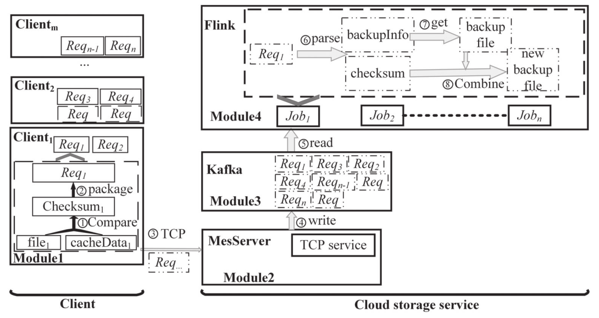

## PandaSync: 网络和工作负载感知的混合云同步优化

> PandaSync: Network and Workload aware Hybrid Cloud Sync Optimization

**作者：** Suzhen Wu, Longquan Liu, Hong Jiang, Hao Che, Bo Mao

**时间：** 2019

**提出问题：**  
随着越来越多的数据被转移到云端，通过有效的云同步来确保数据的一致性非常重要。现有的云同步方案要么是delta同步，要么是完全同步：
- delta(差分)同步即只发送文件的更新部分，但对小文件来说会产生删除重复数据时的高额计算开销；
- 完全同步即发送完整的文件来避免删除重复数据，但会浪费网络带宽，并且由于在网络上为大文件传输大量冗余数据导致同步时间的延长。

**提出方法：**  
提出了一种混合云同步方案PandaSync，它会根据文件大小及网络状况动态地结合增量同步和完全同步。
且为了进一步提高小文件同步的性能，提出Full2Sync优化方案，该方案将数据同步请求和文件发送请求合并在一起发送，以此减少客户端和云服务器之间的网络往返次数。

**问题详情：**  
增量同步方案中，只同步文件的改变部分能够显著减少网络传输，所以增量同步成为近年来的研究热点。
但是，<mark>增量同步方案在关键I/O路径上会产生大量的**计算开销**，这也是现有研究**试图解决的关键问题**</mark>。  
- 为什么着重小文件？  
研究表明，小文件在企业和云环境的工作负载中占据主导地位，也占所有用户操作的80%以上，所以对小文件的增量同步至关重要。
本文作者研究发现，即使在增量很小的情况下，采用增量同步方案来同步小文件，仍然会有很高的计算量和网络开销，
比如，在10KB文件中只更新了3KB内容的情况下，采用固定大小分块的增量同步方案会使同步延迟比完全同步方案增加20%以上。
此外，对于小文件同步，网络延迟占同步延迟的50%以上。所以，可以归纳为，小文件占比很重且小文件的网络传输有待优化。
- 其它文献研究的缺陷？  
比如QuickSync、DeltaCFS、WebDelta都是基于单一的增量同步方案，缺乏将完全同步和增量同步结合起来的同步方案，
不能根据网络性能和文件特点进行同步。
- 作者发现？  
无论是完全同步还是增量同步，网络传输的耗时在小文件同步的总同步时间中都占据着占主导地位，这意味着可以通过减少客户端和云服务器之间的网络交互时间来优化网络传输，从而加速同步的时间。
此外，随着文件大小的增加，增量同步的计算开销会大于其网络传输的开销，尤其是对基于CDC内容定义分块的增量同步而言更加明显。因此：
  - 对于小文件同步，采取完全同步方案明显要优于增量同步方案；
  - 网络传输占据了小文件同步的大部分时间，即客户端和服务器之间的往返时间大大超过了网络的数据传输时间，这也是可以优化的点。
  > 以上这两个问题，之前的研究还未解决。 
  
在存储系统设计中还必须考虑应用产生的工作负载的特点。比如，I/O请求大小的分布是工作负载特性的一个重要因素，因为了解I/O请求的大小可以直接帮助对某些参数进行适当的配置。
但现有研究集中在增量同步方案的计算开销，但本文研究证明增量同步对小文件同步而言并不有效，相反，应对小文件采取完全同步方案。  

> 综上所述，该文的创新点/研究点在于：
> 1. 设计的算法能动态切换完全同步和增量同步，特别是和别的文献不同的是，该文首次对小文件采取完全同步方案。
> 2. 设计的算法考虑到了利用工作负载特点和网络特点。
> 3. 将小文件的同步请求和发送文件请求合并为一个请求，以减少网络通讯的时间。

**方法详情：**  
- 总思想：  
为了解决云存储中的**同步效率**问题，提出一种混合数据同步方法PandaSync，它在完全同步和增量同步之间动态切换，能很好适应网络性能和工作负载特性的变化。
与现有的同步方法不同的是，<mark>PandaSync对小文件采用完全同步，对大文件采用基于固定大小分块的增量同步</mark>，其中小文件和大文件之间的大小阈值是基于网络往返时间RTT。
通过利用工作负载特征和网络条件，充分利用了完全同步和增量同步方案的优点并减轻了它们的缺点。
同时，针对小文件同步进行了优化，PandaSync中的Full2Sync可以将小文件的同步请求和发送请求合并为一个请求，进一步减少客户端和云服务器之间的网络往返交互次数。  

**方法设计：**  
PandaSync总体架构如下图所示：  

  

PandaSync由三个功能模块组成：文件大小监视器、网络动态感知阈值器和同步方案选择器。  
- <u>文件大小监视器负责</u>：获取待同步文件大小的信息，并计算校验和，以便之后的一致性检查；
- <u>网络动态感知阈值器负责</u>：根据网络性能确定区分大、小文件的动态阈值；
   网络感知动态阈值模块需要通过"ping"命令自适应地跟踪客户端的网络RTT值。一旦获得网络RTT值，就能确定相应的大小阈值，并应用于后续的同步文件。
- <u>同步方案选择器负责</u>：收集发送到这里的信息，然后在完全同步和增量同步之间进行选择，其中，Full2Sync是对小文件的完全同步方法的一种优化。
  在文件准备同步时，先获取该文件大小，与网络动态感知阈值进行比较，若大于阈值，则进行增量同步，否则进行改进的Full2Sync的完全同步，阈值高度依赖于网络性能。  

网络动态感知阈值定义如下：  
首先，通过公式（1）和（2）分别定义固定分块的增量同步时间、Full2Sync的完全同步时间。其中，R表示RTT，F表示同步文件大小，
其余参数，如处理延迟、查询延迟是作者从实验中得到的：  

  

再联立两者，得到网络动态阈值，即根据RTT确定出区分大小文件的阈值：  

  

---
接下来，是对小文件的同步优化。  
提出Full2Sync的小文件完全同步方法，考虑到同步性能仍依赖于网络延迟，所以作者将同步请求和同步数据合并在一起，这样就减少客户端和服务器的交互次数，最大限度地利用网络带宽。  

---
与现有的优化相比，PandaSync根据文件的特性和网络性能，动态地、明智地在完全同步方案和增量同步方案之间切换。
此外，由于使用改进的Full2Sync，PandaSync进一步优化了小文件同步工作流程，从而大大降低了同步延迟，即更短的同步时延。

**数据集：**  
PandaSync原型是建立在Rsync 3.1.3版本之上的。它在客户端增加和修改了2945个LOC，在服务器端增加了1152个LOC。  
PandaSync原型的源代码可在：https://github.com/LongquanLiu/PandaSync 上访问。

**未来研究：**
1. 首先，数据冗余特性是决定是否对大文件应用增量同步的重要因素。
   然而，对于一个特定的文件来说，数据冗余特性是很难测量或提前预测的。
   作者将进一步研究如何通过利用工作负载特性来减少大文件的同步延迟。

**补充知识：**  
1. 数据同步是云存储服务的主要和关键技术，允许客户端自动使本地文件与存储在远程云数据中心的文件一致。
   从云存储提供商的角度来看，较短的同步延迟意味着更高的系统吞吐量，能直接提高数据中心的性能和成本效率，
   因此，**同步性能**被认为是云存储服务最重要的因素，并直接影响系统的一致性和吞吐量。
2. 云同步是指，使多个设备/用户中的文件副本保持最新并在整个云中保持一致的过程。对于云同步，用户首先设置一个基于云的文件夹，将所需文件复制到该文件夹；
该文件夹使多个用户可以在他们使用的任何设备上通过云界面访问文件。
当用户更新设备上的文件时，修改后的文件会自动与云文件夹以及其他设备/用户上的相应文件夹进行同步。
3. 经典的增量同步算法有两种：
   - 固定大小分块
   - 内容定义分块 (CDC)
4. 为了更好地理解性能结果，同步时间被分解为：花在客户端、网络传输和服务器端的时间。
5. 网络往返时延RTT：指数据包从传输到网络再到发送方收到数据包的确认的时间。例如，数据包的正向和反向的路径延迟之和。
   网络RTT会受到许多因素的影响，如网络排队和路径长度，这些因素可能会随着时间的推移而变化。

---

## NetSync: 基于云存储服务的网络自适应和重复数据删除触发的增量同步方法

> NetSync: A Network Adaptive and Deduplication-Inspired Delta Synchronization Approach for Cloud Storage Services

**作者：** Wen Xia, Can Wei, Zhenhua Li, Xuan Wang, and Xiangyu Zou

**时间：** 2022

**提出问题：**  
1. 前人的研究，如DeltaCFS、PandaSync和WebR2sync+，虽然在各个方面改进了rsync，但他们都是基于rsync的，而rsync使用逐字节滑动窗口的块匹配过程可能非常耗时，尤其是当文件在高带宽云存储系统中越来越大时。
2. 传统的rsync同步难以满足即将到来的高带宽的云存储服务，这些服务需要轻量级的增量同步，去支持大文件同步。
3. 传统的rsync在同步过程中采用了固定的分块和压缩方法，使得它无法满足各种网络环境的服务。
4. 网络基础设施的进步使得目前的增量同步更难满足云存储的需求，因为客户端网络带宽的范围本来就比较大，而云端托管的文件尺寸也比较大，这是不可避免的挑战。  

**提出方法：**  
作者提出一种NetSync方法， 这是一种基于网络自适应的、CDC的、轻量级的增量同步方法。与最先进的增量同步方法相比，NetSync方法的计算开销和协议（元数据）开销更少。
NetSync可以针对不同的网络条件选择适当的压缩和分块策略。  
NetSync的关键思想是：   
（1）提出FastFP的<u>**快速**</u>弱散列来替换rsync中原本的Adler32，来简化弱散列块匹配过程，FastFP是基于CDC的滚动散列。  
（2）通过利用重复数据消除局部性和弱/强散列属性，重新设计增量同步协议；  
（3）根据当前网络条件自适应选择分块的参数和压缩方法，以最小化同步时间。  
与最先进的基于rsync的WebR2sync+方法和基于重复数据删除的方法相比，NetSync执行速度快2-10倍，支持的客户端数量多30%-80%

**问题详情：**  
1. 作者研究发现，减少<u>通信量</u>和<u>计算开销</u>，并在同步过程中充分利用当前<u>网络带宽</u>，仍然是增量同步需要解决的重要挑战。
2. rsync方法由于采用字节比较和哈希计算，会产生高额的计算开销，严重限制了它在**资源有限的客户端**的适用性，特别是当增量同步大文件时，计算开销特别大。
   因此，作者专注于为资源受限的客户端系统提供一种轻量级的、可移植的增量同步方法，通过手机、物联网设备等的Web浏览器进行同步。
3. 基于rsync同步的原始通信协议，对于基于CDC的方法来说并不高效，强散列计算和一些不匹配块的网络流量是不必要的。
4. 通用设计的配置对一般情况来说可能是次优的，需要根据网络状态来选择不同的配置。

**方法详情：**  
作者主要关注同步方法的两个最重要的指标：同步性能和灵活性。
- 同步性能：抛弃rsync中耗时的逐字节滑动窗口的块匹配，而是通过引入FastCDC技术，减少计算开销，提高同步性能。
- 灵活性：合理的做法是重新设计通信协议，根网络状况相应地改变同步配置，而不是在任何网络条件下使用不变的配置。
  它的挑战在于：1、在不影响同步的情况下监控网络状况；2、选择最佳的分块粒度和压缩方法，以尽量减少整体同步时间。此外，作者的实现是基于网络浏览器（最普遍的且独立于操作系统的访问），以获得更好的平台适应性。

> 研究点：NetSync是第一次尝试将<u>**CDC技术**</u>与<u>**传统的rsync模型**</u>相结合，以便在客户端受到资源限制时有效地同步数据，即在客户端没有本地缓冲区和足够的计算能力来执行类似rsync的增量同步协议。  

首先，在rsync中引入内容定义分块技术（即FastCDC），以匹配更多相同的内容并减少网络流量。
  同时，利用分块过程为分块生成弱散列值，称为FastFP，用FastFP取代rsync中使用的Adler32来生成弱指纹，来抵消了引入CDC所造成的的额外计算开销。  
其次，重新设计通信协议，减少计算开销和网络流量。  
（1）首先检查弱散列，然后计算并匹配弱散列匹配的块的强散列，以减少对不匹配的块的大部分不必要的强散列计算（减少计算开销）； 
（2）将连续的弱散列匹配的块合并成一个大块，以减少NetSync中网络交互的Match Token的大小（减少网络流量）。  

接着，通过网络自适应设计使同步时间最小化：  
（1）网络自适应压缩：根据网络感知模块得到的当前网络状况选择合适的压缩器进行压缩后传输；  
（2）网络自适应分块：根据当前网络状况改变CDC进程的分块粒度，网络好则分块粒度大，充分利用CDC的潜力和当前网络资源，从而使同步时间最小化。  

**方法设计：**  
NetSync的总体架构如下图所示：  

- Chunker。
  分块器，客户端和服务器文件将首先被FastCDC分成若干块，以便将来进行重复检测。
- 弱/强散列。
  该模块已被嵌入到chunker和matcher中。在该模块中，两级哈希值（即弱/强散列）被计算出来，用于检查重复的块。
  弱散列值快速且计算开销低，用于快速检查潜在的重复块，一旦识别出可能重复的块，再由强散列值进一步确认，以避免散列碰撞。
  否则，如果弱散列不匹配，则该块被标记为不重复的，就跳过强散列值。注意，WebR2sync+中使用的强哈希SipHash在NetSync中出于密码学考虑替换成SHA-1。
- matcher（哈希匹配）。
  在NetSync中，块的弱哈希值（即FastFP），将被比较以找到服务器上可能重复的块，再用强哈希值在客户端进一步确认。只有经那些强哈希值（即SHA-1）计算后仍然匹配的块才会被视为重复的块。
  否则，它们将被标记为新的块（即增量数据），并发送到服务器。
- 通信协议。
  该模块负责NetSync中客户端和服务器之间的通信。用于检查文件的弱哈希值和强哈希值，并最终传输增量数据进行同步。
- 网络自适应选择器。
  该模块负责在NetSync中选择最佳配置（即最佳的压缩器和分块颗粒度）。用于定期探测网络状况（网络监控器），并设置服务，通过选择最佳的压缩选择器和分块选择器来尽可能的优化同步性能。
---
一般工作流程概述（结合下图）：  

1. 首先，网络监控器探测网络状况并设置同步过程以获得最佳性能。
2. 开始同步过程，客户端的chunker通过FastCDC将客户端修改后的文件分成若干个块，并计算它们的弱指纹（即FastFP），并将弱指纹和各块的索引打包成Checksum List发送到服务器。
3. 服务器端的chunker以同样的方式分割服务器上的原文件。
4. 服务器端收到客户端发送来的Checksum List，就可以通过服务器端的matcher列出客户端和服务器端文件之间的弱哈希匹配的块（即可能的重复块），并将弱哈希匹配块的索引和该块的强哈希值（SHA-1）发送给客户端。
5. 客户端matcher检查这些块的强哈希值后，记录<u>重复</u>块的ID，通过patcher将<u>非重复</u>的块连同它们的索引，形成增量字节，并打包成Patch Tokens发送到服务器。
6. 最终，服务器端patcher整合重复和不重复的块的信息，在服务器端恢复客户端的文件，然后增量同步结束。

---
接下来详细讲述细节：  
1. FastFP：FastCDC中高效的弱哈希值。
2. 通信协议：降低不匹配块的强哈希计算开销和元数据传输开销。  
   作者研究发现，NetSync原型中，一旦弱哈希不匹配，则完全不用计算强哈希，所以原本的强哈希计算可以省略，上述的NetSync的一般流程就是新建的通信协议。
3. 减少网络流量：
   

     
   

   这是通过合并连续的几个弱哈希匹配块来实现的。
   在收到客户端的Checksum List之后，服务器端将服务器上的原文件f分割成若干块，并像客户端那样计算它们的弱哈希值。
   然后服务器将其文件f的弱哈希值与Checksum List中的弱哈希值进行比较。
   将连续的、匹配的弱哈希值块合并。之后，对它们整体进行强哈希计算，就会只有一个强哈希值将被计算出来，并被送回客户端供以后比较，换句话说，这种合并有助于减少元数据流量。  
   合并虽然可以帮助减少元数据流量。但可能发生合并碰撞，当"合并碰撞"发生时，合并将受到惩罚。
   此外，合并还有助于减少强散列（即SHA-1）的计算开销。
4. 网络自适应选择器：  
   由于网络带宽和同步参数之间的不匹配会降低数据同步的整体性能，所以有了该模块。下图是该模块：
   

   
   

   
   - 网络感知模块：
   

   
   

   简单来说，该模块是测试网络质量的，步骤如下：
   先生成一些随机数的数组，每个数组256kb或1MB；
   然后将数组以数据流的形式发送到服务器，等待接受返回的Acks，每隔200毫秒发送一次数组，
   这样，网络带宽将根据传输的数据量和传输时间计算得到，并保存到速度测试队列；
   经过多次速度测试，就能得到平均的网络带宽结果，并保存到测试队列，以供之后的压缩器和分块选择器使用。

   - 网络自适应压缩器
     由于网络传输占同步延迟的很大一部分，所以要么减少传输的数据量，要么使用高带宽，作者使用的压缩以减少数据量。  
     引入压缩器后，网络传输时间如下：
     

     
     

    Rx是压缩比，D是数据的原始大小，N是网络带宽，tcx(D)是压缩数据D的时间，tdx(D)是解压数据D的时间，tp是网络延迟（即往返时间RTT的一半）。
    
   - 网络自适应分块：  
     当网络带宽较低时，作者为分块器设置较小的分块大小，这有助于在增加计算开销的同时尽量减少网络传输时间；而当网络带宽较高时，设置较大的分块大小。  
     具体来说，初始的分块大小设置为1KB，随着网络条件的改善/恶化，分块选择器根据我实验研究自动选择更大/更小的分块大小。
     - 当网络带宽为(0, 10)、[10, 40)、[40, +∞)Mbps时，分别采用512b、1kb、2kb的分块大小；
   

**评估指标：**  
从两个主要指标来评估增量同步方法：同步时间和同步流量。
- 同步时间指标是指花在同步过程中的时间。
- 同步流量指标衡量传输的数据总量，包括Checksum List、Match Token和Delta Bytes

**数据集：**  
Silesia是一个被广泛认可的数据压缩数据集，涵盖常用的典型数据类型，包括文本、可执行文件、图片、HTML等。    

**补充知识：**  
1. 增量同步的经典算法rsync的原理：

假设rsync将修改后的文件f'，需要从客户端同步到服务器，有以下3个步骤：  
- 首先，客户端向服务器发送同步请求，服务器收到请求后，将服务器上的原文件f分割成固定大小的块，随后服务器计算弱而快的哈希值Adler32和强而慢的哈希值MD5，并发送各个块的指纹（统称为Checksum List）给客户端。
- 接着，客户端使用一个<u>固定大小的窗口</u>对客户端上的修改后的文件f'进行逐个字节的滑动，以匹配来自服务器的Checksum List中可能的重复块。
- 在完成逐个字节的匹配后，客户端就可以获得不匹配的块，即修改了的数据，将其命名为Delta Bytes（增量字节），并发送给服务器，之后服务器根据Delta Bytes和服务器上的原文件f重建客户端文件f'，这样服务器上的原文件就得以更改了。

> 增量同步之所以叫做“增量”，就是在于不是把文件全部发过去一一比对出不同的地方，再做修改，这样就和完全同步一样了；而是通过计算两者的Checksum List，比对校验和，进行同步。

2. 重复数据块检测技术分为，固定分块检测技术(FSP)，可变分块检测技术(VSP)和滑动块技术(Sliding Block)。
   - 固定分块将数据流按固定的长度分块，实现很简单，但某一处数据的变化将导致之后的所有分块都发生变化，从而无法进行匹配。因此，固定分块技术在实际中应用较少。
   - 可变分块技术则可弥补固定分块技术的这一局限性，能更加灵活的找出重复数据。基于内容可变长度分块(CDC)是可变分块(VSP)中的一种。

3. CDC的理论基础是rabin fingerprint  
   具体实现：文件被分为可变长度的数据块，数据块的长度规定在一个最小值和最大值之间。
   可变长度的数据块用一个滑动窗口来划分，当滑动窗口的hash值与一个基准值相匹配时就创建一个分块，
   这样数据块的尺寸就可达到一个期望的分布。Rabin’s fingerprint预先定义两个整数D和r(r<D)一个大小为w的固定窗口在文件上滑动。
   假如在位置k，固定窗口内数据的hash值为f，如果f mod D = r，则该位置为数据块的一个边界。重复这个过程，直至整个文件都被分块。  
   如果选择的D和r不合适，会导致窗口过小(很容易匹配上)或过大(很难匹配上)。  
   现在有一串数据D0：(ABCDEFGHIJKLMNOP)，以固定分块为(ABCD | EFGH | IJKL | MNOP )，假如中间某部分数据发生了变化，数据变为D1：(ABCDEF22GHIJKLMNOP)：  
   如采用固定分块，则固定分块为(ABCD | EF22 | GHIJ | KLMN | OP)，除了第一块，其他所有的块都无法完成匹配。
   如果采用CDC，假设初始分块也是(ABCD | EFGH | IJKL | MNOP)，那么意味着在D, H, L这三个窗口内，是符合f mod D =r 的条件的，
   当数据发生改变时，由于DHL这三个窗口并未发生改变，他们依然被认定为边界，那么分块有可能变成(ABCD | EF22GH | IJKL | MNOP)，
   这样，除了发生改变的第二个块不能完成匹配外，其他三个数据块的匹配不会收到影响。
- CDC的优点：
   - 减少产生大块的指纹和索引，特别是对于大文件。
- CDC的缺陷：
   - CDC为增量同步引入了额外的计算开销，因为需要计算用于分块的滚动哈希值；
   - 基于rsync的方法，CDC可能会造成更多的网络流量，因为它可能无法消除相似块之间的冗余。

4. 根据几个已发表的关于实际数据和基准数据集的研究，文件修改一般是在文件的开头、中间和结尾进行的，其分布分别为70%、10%和20%。

---

## Dsync：云存储服务的轻量级增量同步方法

> Dsync: a Lightweight Delta Synchronization Approach for Cloud Storage Services

**作者：** Yuan He, Lingfeng Xiang, Wen Xia, Hong Jiang, Zhenhua Li, Xuan Wang, and Xiangyu Zou

**时间：** 2020

**提出问题：**  
代表性的增量同步工具rsync通过逐个滑动搜索窗口来匹配数据块，以最大限度地提高冗余检测的带宽效率。
然而，这个过程很难满足即将到来的高带宽云存储服务的需求，这些服务需要轻量级的增量同步，以便很好地支持大文件。

**提出方法：**  
提出Dsync，一种基于CDC的轻量级增量同步方法，其计算和协议（元数据）的开销基本上比现有的增量同步方法要少。
Dsync关键思想如下：  
1. 提出一种新的、快速的弱散列，称为FastFp，它是在CDC的滚动散列上附加的；
2. 通过利用重复数据删除定位和弱/强散列特性重新设计增量同步协议。  

> 作者是在资源受限的客户端系统上，通过手机、物联网设备等的**网络浏览器**，提供一种轻量级、可移植的增量同步方法。

**问题详情：**  
1. 减少同步中的流量和计算开销仍然是一个有待解决的重要挑战。
2. 基于rsync的方法中，使用逐个字节滑动窗口的分块匹配可能会非常耗时，特别是当需要同步的文件在高带宽的云存储系统中越来越大时。
3. 随着5G的出现，云托管的文件在数量和（单文件）大小方面都在增长。
4. 将CDC纳入rsync协议会带来新的挑战，显然，CDC为增量同步引入了额外的计算开销，即计算用于分块的滚动哈希值时的开销，和CDC后粗粒度分块匹配带来的低冗余检测率。

**方法设计：**  

Dsync引入了内容定义分块（CDC），在此基础上进行的优化。如上图所示，用于增量同步的Dsync架构由四部分组成：
内容定义分块、弱/强哈希、通信协议和哈希匹配。
1. 首先，客户端文件f'（要同步的）和服务器文件f将首先被Content-Defined Chunking（即FastCDC）分割成若干块，以便将来检测重复的块。
2. 弱/强哈希。两级哈希值（即弱/强哈希）被计算出来，用于检查重复的块。弱哈希是一种快速且低计算开销的散列，它被用来首先快速检查潜在的重复块，一旦识别出来，就由强哈希进一步确认，强散列是加密的，以避免散列碰撞。否则，如果弱哈希不匹配，该块将被标记为唯一的，强哈希（SHA1）计算将被跳过。
3. 哈希匹配。在这个模块中，首先由服务器比较块的弱哈希，以找到服务器上可能匹配的块，而它们的强哈希将在客户端进一步确认。只有那些强哈希匹配的块才会被视为重复的块。否则，它们将被视为新的块（即增量数据）并被发送到服务器上。
4. 通信协议。它负责Dsync中客户端和服务器之间的交互，以检查上述文件的弱哈希值和强哈希值，最终获得同步的增量数据。  

通过Dsync中上述四个组件的协调操作，不匹配的块将作为增量字节发送到服务器。

**方法详情：**  
这部分详细讲述四个组件的工作原理。
1. FastCDC引入到Dsync中的优势和问题  
   作者直接将FastCDC移植到Dsync中，用于基于WebR2sync+（rsync的改进版本之一）的分块处理，因为FastCDC的计算开销很低。  
   下图是初步的Dsync架构图，更详细、改进的Dsync架构图在“方法详情-3.通信协议”部分中：
   
   

   
   

   
   - 引入FastCDC后增量同步的整体流程：
     - 预处理阶段。客户端先用FastCDC将要同步的文件分割成多个块，并计算Adler32和SHA-1指纹，并封装成ChecksumList发送到服务器上。由于不像rsync那样分成固定大小的块，所以该阶段会产生额外的计算开销，理论上慢于rsync。
     - 匹配阶段。服务器收到ChecksumList后，就开始对其原文件f进行FastCDC分块和计算两级指纹；然后，服务器根据弱指纹Adler32在ChecksumList中搜索与f可能匹配的块；接着，将可能匹配的块和强指纹封装成MatchToken发送到客户端。该阶段要比rsync快得多，因为rsync是在没有匹配的情况下，去逐块比较数据。
     - 重构阶段。客户端收到MatchToken后，再用强指纹对MatchToken中可能匹配的块进行验证，避免散列碰撞，就会得到不匹配的块，即增量字节DeltasBytes，并发送到服务器；由服务器根据增量字节和原文件重构出客户端上要同步的文件。该阶段和rsync一样。  
   
   > 总结：相对于rsync，作者修改了预处理阶段和匹配阶段，没有修改重构阶段。
   
   - 优点：
     由于引入了FastCDC，所以简化了重复块的比较，整体计算开销与rsync相比，有所降低。
   - 弱点：
     - 在预处理阶段，CDC带来的额外计算开销；
     - 由于CDC之后的粗粒度块状匹配，导致冗余检测率低。
   
   > 优化：
   >  - 对于第一个弱点，利用FastCDC中产生的哈希值作为弱哈希值，弥补其额外的计算开销。
   >  - 对于第二个弱点，重新设计通信协议，以最小化匹配阶段的MatchToken的元数据大小，同时也最小化整个Dsync的哈希计算。
     
---

2. FastFp  
   由于CDC是通过使用<u>滚动哈希算法</u>对数据进行滑动，因此在CDC期间根据滚动哈希快速获得Dsync的弱哈希是可行的，用它来取代rsync中的弱哈希Alder32。  
   作者提出了一种新的快速弱哈希FastFp，如下图所示：

   

   
   

   &emsp; 将滑动窗口的长度改为32字节，由于CDC采用滚动哈希，这样原始的Gear哈希值只与距离切割点32字节的内容有关；并且为了使Gear哈希值能够代表一个数据的全部内容，可以通过特定的操作将不同窗口的Gear哈希结合起来，例如，可以使用“+”来产生一个新的哈希值。这就是FastFp。  
   &emsp; 具体来说，滑动窗口的哈希值将在每一次滑动到一定距离（16字节）时被添加。  
   FastFp和原本的Gear哈希的最大区别在于：  
   &emsp; Gear哈希只能与大块的一个非常有限的范围（即滑动窗口大小）有关，而FastFp则与大块的所有内容有关，因为它通过“+”将许多Gear哈希**合并**成一个哈希值。
   这些加法不仅操作轻量，而且不会影响FastCDC的整体性能。所以FastFp的速度非常快，因为它只在滑动窗口每次移动16个字节后增加一次加法。

---

3. 通信协议  
   新的通信协议，能够减少计算开销，同时最大限度地减少网络流量。  
   主要在于减少强哈希的开销，即在一些不必要的地方取消计算强哈希，新的通信协议如下图所示：  
   
   

   
   
  

   - 预处理阶段。Dsync使用FastCDC将客户端要同步的文件f'分割成若干块，并生成它们的弱哈希值（FastFp）。然后将FastFp哈希值和块的长度被打包到校验列表ChecksumList中（现在不再是是强哈希SHA1）并发送给服务器。
   - 匹配阶段。服务器收到ChecksumList后，也使用FastCDC将原文件f分成若干个块，并计算弱哈希值FastFp；接着，在ChecksumList中搜索与f中各块可能匹配的弱哈希值；如果一个块的弱哈希被匹配，则计算出其强哈希值SHA-1，再将所有可能匹配的块的索引ID和其SHA-1值统一打包成MatchToken发送到客户端；
       客户端收到MatchToken后，根据MatchToken中弱哈希匹配的块的索引计算f'的强哈希值SHA-1，找出不匹配的块，即要同步的增量数据。
   - 重构阶段。将不匹配的块和其索引ID统一打包成DeltaBytes，并发送到服务器；由服务器根据原文件f和DeltaBytes重构出同步文件f'。

   > 注意：索引是指Checksum List中该块的序列号。

   > 与初代的Dsync的架构图相比，该版本的优化之处在于：  
   > （1）减少了计算强哈希的开销：一是客户端在收到服务器的MatchToken之前，都不会计算强哈希SHA-1，二是只有上弱哈希匹配的块才会被计算强哈希以确认是重复块。  
   > （2）降低了网络流量：弱哈希匹配的、连续的块可以组成为一个更大的块，大大减少了元数据的流量，即MatchToken中的量。

   对于（2），有一个细节，即弱哈希匹配的、连续的块组成一个大块：  
   
   

   
   
  

   服务器在收到客户端的ChecksumList后，使用FastCDC进行分块和计算弱哈希值，并将其弱哈希值与ChecksumList中的弱哈希进行比较；将连续的弱哈希匹配的块看做一个更大的块，对这个大块计算强哈希SHA-1，再返回给客户端。  
   如果合并后的大块与客户端的强哈希不匹配，若合并后的大块超过预定的阈值（800kb），则转移组成的大块的强哈希指纹；否则没有超过阈值，则不匹配的块直接转移到服务器上。

   ---

   Dsync架构中，数据在不同阶段的形式：  
   
   

   
   
  

   - 在第一阶段，Checksum List以块的总数开始，然后是块的长度和散列，逐一列出。在这个阶段，数据索引没有被附加，但大块序列被存储在服务器上。
   - 在第二阶段，Match Token表示匹配的块，以块的总数开始（注意这里每个块是由连续弱哈希匹配的块合并而成），然后是每个块的元数据，而每个块的元数据由三部分组成：第一个未合并的块索引、合并后的块的组成数量和强哈希SHA-1。
   - 在第三阶段，数据也是从独特的块的数量开始的，接下来是这些独特块的详细信息。块的信息由其索引、长度和内容组成。

**数据集：**  
- 带宽调整为100Mbps，rtt为30ms。  
- 在开源的WebR2sync+的基础上构建Dsync。Dsync是由总共2000行的JavaScript和200行的C代码编写而成。  
- 基准数据集：  
  Silesia是一个被广泛认可的数据压缩数据集，涵盖了常用的典型数据类型，包括文本、可执行文件、图片、htmls等。
  为了生成基准数据集，从Silesia语料库中切出10MB，对文件进行修改，修改大小分别为32B、256B、2KB、16KB、128KB和1MB。
- 真实数据集：  
  PPT、GLib源代码、图片、邮件。

**评估标准：**  
1. 弱哈希FastFp的评估指标：  
   哈希速度和哈希碰撞率是评估弱哈希FastFp有效性的两个最重要的指标。根据下式定义碰撞率：

   

   
   
  

   该式表示具有相同弱哈希值的两个不同的块的总组合除以从所有块中挑选任意两个块的组合。  
   其中，i表示一个给定的弱哈希值发生碰撞的次数，ni表示发生i次碰撞的弱哈希指纹的数量。
   例如，有10个不同的块共享一个弱哈希值（即同一个弱哈希值发生了10次碰撞），且这样的弱哈希指纹有7个，则i=10，ni=7。
2. 通信协议的评估：
   比较Cut、Insert、Inverse三种情况下，多个算法与Dsync算法随着文件量增加的同步时间的比较。
3. 总体评估：
   评估包括Dsync的同步时间分解，文件大小对Dsync性能的影响，以及支持多个客户端的能力。
4. 评估Dsync在千兆网络环境下的大文件性能

**补充知识：**  
- 当文件被频繁修改时，例如有多个版本或连续编辑的文件，增量同步更具显著优势。
- 数据压缩是减少网络流量的常见做法，Dsync和WebR2Sync+都启用了网络浏览器支持的同步消息的默认压缩。一般来说，数据压缩是在网络流量大小和CPU开销之间进行权衡的一种尝试。  
  在带宽足够高的情况下，压缩反而会减慢整体同步速度；但在网络不足的情况下压缩会使同步速度加快。据观察，只有当网络低于100Mbps时，默认压缩才会使Dsync更快。
- 什么是哈希指纹？
  通过一定的哈希算法（典型的哈希算法有MD5，SHA-1等），将一段较长的数据映射为较短小的数据，这段较短小的数据即为原始较长数据的哈希指纹。
  
  

  
  
  

---

## 基于WebAssembly的云存储服务增量同步

> WebAssembly-based Delta Sync for Cloud Storage Services

**作者：** JIANWEI ZHENG, ZHENHUA LI, YUANHUI QIU, and HAO LIN, HE XIAO, YANG LI, and YUNHAO LIU

**时间：** 2021  

**源代码：**  https://WASMDeltaSync.github.io

**提出问题：**  
<mark>现有的大部分增量同步技术只适用于PC客户端和移动应用程序，并不适用于Web浏览器</mark>。
但对于新兴的面向云的系统和设备(如Chrome OS和Chromebook)，Web浏览器可能是访问云存储的唯一选择。
所以，需要对Web浏览器进行增量同步的研究。

**提出方法：**  
- 采用WASM来计算MD5，减少客户端的计算开销；
- 设计同步-异步代码解耦，减少等待/异步开销；
- 采用流失编译的WASM API，提高WASM模块的加载效率；
- 设计IIFC机制，减少服务器的内存消耗。  

最终，使得Web浏览器的增量同步时间与PC客户端的rsync方法的同步时间很接近，但它节省了服务端50%的内存消耗，保证了可靠性、工业的适用性。

**方法详情：**  

> 1 WebRsync

采用JavaScript + WebSocket + HTML5 API实现在Web上的rsync算法，适用于任何Web浏览器。  

  

如上图所示，在WebRsync中，当用户将文件f编辑到f'时，客户端立即向服务器发送文件同步请求。在接收请求时，服务器首先对服务器上的f进行固定大小的块分割和指纹操作，然后向客户端返回f的校验和列表。除最后一个块外，每个数据块的大小通常为8KB。因此，当f的大小为1MB时，它的校验和列表包含128个弱32位校验和和128个强128位MD5校验和。之后，基于f的校验和列表，客户端首先对f'执行块搜索和比较操作，然后生成匹配的标记和文字字节。
注意，搜索和比较操作都是以逐字节的方式对滚动校验和进行的；相比之下，分割和指纹操作都是以块接块的方式进行的，因此它们的计算开销要小得多。
匹配的标记表示f和f'之间的重叠的数据，而文字字节表示f'中相对于f的增量部分。它们都被发送到服务器来构造f'。最后，服务器向客户机返回一个确认，以结束这个过程。  

但经实验发现，该方法同步速度不如rsync，原因在于耗费了大量的时间在客户端上的JavaScript执行，导致CPU消耗高。

> 2 WebRsync-native

这是第一种优化方法，它在WebRsync基础上，利用web浏览器的本地客户端/本地沙盒，使同步时间接近于rsync，降低CPU消耗，避免浏览器停滞，但需要下载额外的浏览器插件，不具有可用性和普遍性。

> 3 WebRsync+

利用文件编辑局部性和轻量级哈希算法来减少<mark>客户端</mark>计算开销，WebRsync+的客户端时间消耗显著降低。但WebRsync+不能完全避免浏览器停滞。  

<mark>WebRsync的缺点不能仅仅通过客户端优化从根本上解决。也就是说，可能需要更全面的解决方案，其中也包括服务器端。</mark>

---

> 4 WebR2Sync+

  

首先，如上图所示，先将计算密集型的搜索和比较操作转移到服务器上，而轻量级的块分割和指纹操作转移到客户端上执行，这避免了客户端的浏览器停滞，但是会导致服务器的计算开销增大，且服务器的计算开销归因于MD5校验和的计算。  

> 通过研究发现，文件操作是有规律的，通常会对文件进行连续的子编辑，即文件编辑具有局部性。且如果发现f'的第i个块匹配f'的第j个块时，f'的(i+1)个块极有可能匹配f'的(j+1)个块。因此，可以通过直接比较f'的第(i+1)个块和f'的第(j+1)个块的MD5校验和来“简化”3级块搜索方案。如果两个块是相同的，我们简单地向前移动到下一个块，并将这个过程称为旁路块搜索；否则，返回到常规的3级块搜索方案。  
简而言之，如果文件具有良好局部性的文件编辑，则可以不修改连续的块，这使得能够执行更轻量级的绕过块搜索，而不是繁重的3级块搜索。  

接着，采用SipHash+Spooky代替MD5，以减少计算开销，只有当文件同步的全内容哈希检查（Spooky）失败，才会使用回MD5重新同步文件。  

总的来说，WebR2Sync+的同步时间很接近rsync，但存在两个缺陷：  
（1）虽然SipHash可以降低计算开销，但其碰撞率比MD5要高三个数量级，可能会导致同步错误。  
（2）由于WebR2Sync+是逆转客户端、服务器的操作，使得企业实施该方法的成本高。

---

> 最终方法：WASMrsync+  

该方法没有逆转，基本保留了rsync的原始工作流顺序。  

基于WebRsync，直接采用WASM，利用WASM来计算MD5并打包成一个动态库，可以减轻客户端的计算开销。  
但由于保留了rsync的原始工作流，所以存在缺陷，使得同步时间耗费在客户端和服务器上了，因此，需要进行额外的双重努力来优化客户端，并且设计一种机制来提高服务器性能。  

1. 优化客户端  
   - 将WASM API设计成异步的，这就需要进行同步-异步代码解耦。解耦操作，就是从异步代码模块中提取出同步的、非WASM的代码。
   - 当客户端在加载WASM模块时，采用流编译来满足WASM模块的并行化，而流编译的实现是通过使用WASM API-WebAssembly.instantiateStreaming来替换WebAssembly.compile和WebAssembly。  
   
   这样，就可以进一步减轻客户端的计算开销了。  

2. 优化服务器  
   作者研究发现，服务器上耗时是因为当服务器处理大文件（>=10MB）时，服务器内存消耗高，而且耗时主要花费在了文件的重构上，这是由于采用rsync的原始工作流
导致的，因为rsync在服务器重构文件时，有太多的内存分配、拷贝操作，消耗很多内存资源。  

   因此，需要重新设计一套文件重构机制，称为知情原文件重构机制IIFC：  
   - 一是执行单一的增量内存分配，防止过度耗时的内存分配、拷贝操作；二是重用旧文件已经占用的内存空间，以消除在构建更新文件时所需的额外内存空间。

   - 具体操作如下：  
     - 首先，修改客户端，使客户端提前发送更新文件的大小通知服务器，那么服务器就可以根据文件大小，在旧文件所占内存空间上进行一次增量内存分配；
     - 再将客户端上匹配和不匹配的块分别编码成“复制”和“添加”两种操作，与literal bytes一起发送给服务器；
     - 服务器则可以根据编码信息和literal bytes，先将不匹配的数据块从原始内存区域复制到新的内存区域，再将更改的数据块添加到新的内存区域。

3. 修改了WASMrsync+的工作流程，体现了IIFC机制  
   - 首先，根据块搜索和比较结果将(Copy或Add)操作编码到更新文件的块之后，客户机在内存中缓冲Copy和Add操作。对于匹配的块，只需要缓冲它们的源偏移量和目标偏移量；不匹配的块则需要一个额外的字段来表示块数据的长度。这样就可以得到原始的块依赖图，它可能存在于所有Copy操作之间的循环。
   - 其次，为了确保同步结果的正确性，需要对原始依赖图进行拓扑排序，并在检测到循环时中断它们。为此，作者设计了一种基于DFS的算法。该算法构造了一个有向图(记为G = (N, E))，其中边E=(e1, e2, e3，…)表示Copy动作之间的排序约束，节点N=(n1, n2, n3，…)表示匹配的块。不匹配的块是自描述的，不需要来自旧区域的数据。因此，Add操作不需要重新排序。图的拓扑排序决定了在服务器上处理Copy操作的执行顺序。当由于图中存在循环而证明整体拓扑排序不可能时，则将随机地将操作转换为从Copy到Add循环中的一个节点，并显式地添加相应的块数据。最后，就可以得到一个没有循环的新的块依赖树。
   - 在以上步骤之后，客户端向服务器端交付新的块依赖关系图，然后是literal bytes。
   - 最后，服务器在接收数据时应用Copy或Add操作。服务器寻找给定的偏移量，从原始内存区域复制匹配的块，或者插入不匹配的数据块。

4. IIFC的缺点  
   - 缓冲Copy和Add操作会消耗额外的内存空间(通常从几KB到几十KB不等)，但是对于大文件(≥10MB)来说，IIFC比传统rsync中所需的内存空间要少得多。
   - 在将数据传输到服务器之前，检测和解决依赖关系的过程需要额外的时间来对所有Copy操作进行分析。
传统的rsync通过立即向服务器发送数据来检测和传输匹配的标记和literal bytes，而IIFC在传输数据之前，必须等待找到并分析所有Copy操作。尽管如此，这个过程通常在几十毫秒内完成，因此考虑到内存使用量和同步时间的显著减少，额外的微小同步时间是可以接受的。

**数据集：**  
1. 常规工作负载：  
   对一个典型的文件进行追加、插入、剪切中的某种类型的编辑，该文件的文件大小约为5MB，但编辑操作每10秒执行一次。
2. 密集工作负载：   
   - 使用来自Linux内核源代码树的两个连续版本(版本4.5和版本4.6)的8755对源文件进行基准测试。源文件的平均大小为23KB。
   - 生成模拟真实文件的不同大小的大文件(从10MB、20MB、40MB、60MB、80MB到100MB)。然后，对这些大文件进行不同编辑大小(从1B、10B、100B、1KB、10KB、100KB到1MB)的随机追加、插入和剪切操作。
3. 网络RTT为30ms，网络带宽为100Mbps

    

    
    

4. 由于计算密集型操作(例如块搜索和比较)通常会在客户端带来相当大的计算开销，所以作者开发了StagMeter工具，用来定量的了解用户感知到的网页浏览器停滞。
   StagMeter工具可以定期在相关的网页上打印当前的时间戳(例如，执行增量同步的网页的时间戳)。如果当前时间戳(比如t)在此刻成功打印，则没有停滞；否则出现停滞，则当前时间戳的打印会延迟到t' > t，因此对应的停滞时间计算为t'−t。

**衡量性能的指标：**  
1. 同步效率：  
   即同步速度，将平均同步时间分为三个阶段：客户端、网络、服务器。
2. 计算开销
3. 同步流量
4. 内存使用量
5. 服务吞吐量

---

## SimpleSync:一种基于Flink的并行增量同步方法

> SimpleSync: A parallel delta synchronization method based on Flink

**作者：** Changjian Zhang, Deyu Qi, Wenlin Li, Wenhao Huang, Xinyang Wang

**时间：** 2021

**提出问题：**  
现有的增量同步的研究几乎都是基于Rsync算法提出的同步过程，并适当混合了一些优化，但没有充分考虑到云存储服务的特殊性。云存储服务特殊在，服务器不会主动修改云存储服务中备份文件。

**提出方法：**  
本文提出了一种新的增量同步方法SimpleSync，该方法利用了云存储服务中服务器不主动修改备份文件的特点，去掉了Rsync中的冗余步骤，仅通过一次通信即可实现客户端与服务器端的同步，但代价是牺牲了部分客户端的存储空间。
服务器接收到同步请求后，SimpleSync首先将请求放入Kafka中进行缓冲，然后使用Flink并行处理同步请求。

**问题详情：**  
云服务商为用户提供了便捷的上传、下载、同步、统一查看和管理功能。但是，大量的同步请求会被发送到业务服务器，使得需要响应文件同步的服务器承受巨大的并发压力。单次同步产生的冗余成本会被无限放大。
在现有的研究中，采用了增量同步技术来优化同步请求的过程，但仍然存在冗余成本。这个成本包括同步成本和用户体验成本。

**方法设计：**  
针对上述问题（即冗余成本），本文是从以下四个方面进行了优化：  
1. <mark>基于CDS的增量同步优化：</mark>原本在增量同步过程中，需要从服务器上获得备份文件的校验和，然后客户端根据校验和获得差分数据，只需传输差分数据就能达到增量同步的目的。然而，在云存储服务场景中，数据变化只发生在客户端，这意味着当客户端发起一次同步时，下一次同步所需要的文件内容已经存在于客户端，不需要从服务器上获取。
   为了利用这一现象，本文提出了一个缓存数据结构（CDS），它包含备份文件的校验和，并存储在客户端，不需要从服务器上获取。
2. <mark>基于Kafka对同步请求进行缓存和消峰：</mark>在现有的实现中，通常使用fork线程或clone TCP连接来处理并发请求。这些方法在高并发时（多个并发的同步请求）容易遇到性能瓶颈。为了提高服务器接收同步请求的能力，在CDS的帮助下，本文将传统的同步请求的多次通信简化为一次通信，然后用短连接代替keep-alive连接。另外，为了避免消息生产能力超过处理能力而造成阻塞，将同步请求消息放入Kafka集群中。
3. <mark>基于CDC分块算法的增量数据定位：</mark>原本在同步过程中，客户端是以滚动方式计算抽象值，并与备份文件的校验和进行比较，以定位差异数据。虽然这可以减少服务器的计算负荷，但却增加了客户端的同步成本，从而影响了用户体验。
   为了降低客户端的同步成本，本文使用内容定义分块CDC算法来替代Rsync中使用的固定长度分块。因此，客户端只需要计算每个分块的摘要，而不是逐个字节地滚动计算文件。
4. <mark>基于Flink对同步请求进行并行处理：</mark>为了提高服务器的同步处理能力，本文将同步转化为Flink任务，在分布式框架的帮助下，减少了大量同步请求的处理延迟，提高了用户体验。

总的目标是降低冗余成本，特别是降低同步过程中的同步流量、服务器资源消耗、客户端资源消耗和同步延迟。  

> 多目标优化？

**方法详情：**  
首先，回忆一下Rsync同步的原理：  

  

如上图所示，Rsync是Tridgell提出的一种基于多轮通信的同步算法。首先，将备份文件在服务器上分成固定长度的块，计算块的弱哈希值(Adler-32)和强哈希值(MD5)。然后这些值以校验和的形式发送给客户端。在接收到这个信息后，客户端对源文件执行滚动验证：如果弱哈希值在校验和中没有命中一个，则该块是一个增量分块；否则，将比较强哈希值；如果匹配，则块是相同的，反之亦然。通过两级比较，减少了计算量，保证了验证的准确性。
接着，客户端将比较结果整理成差异信息发送给服务器。然后根据差异信息在服务器上生成新的备份文件，替换原来的备份文件。  

由于Rsync在定长分块算法下的增量同步中有较好的应用，为采用CDC算法进行增量同步提供了可能。在增量同步场景下，数据分块算法需要更精确地定位差分数据，而块大小的稳定性并不重要。因此，在将CDC算法应用于增量同步时，需要重点关注字节的抗移位能力，这会影响切点的稳定性，进而影响差分数据的准确性。
因为分块不是用来存储到物理磁盘上的，而是用来比较和定位差分数据的。为了更好地将CDC算法应用到差分数据采集中，作者分块策略采用的是他们之前研究的<mark>PCI算法</mark>，PCI是通过小窗口模式匹配增强对字节移位的抵抗能力，提高差分数据采集的精度。

---

SimpleSync中客户端和服务器之间的通信过程如下图所示，显然只需要一次通信：  

  

SimpleSync的工作流程如下图所示：

  

在云存储服务场景的某个时间点，多个客户端可能同时向服务器发送同步请求，每个客户端可能发起多个同步请求。我们以一个同步请求为例来介绍SimpleSync的工作流程（和Rsync对比起来看）。  
&emsp;客户端通过比较源文件和CDS获得差异化信息；然后，客户端将差异化信息打包成一个同步请求。同步请求不仅包含差异信息，还包含元数据，如文件名；然后，请求通过TCP连接发送到MesServer，这是一个接收同步请求的节点（注意，只需一次通信）；然后，MesServer将请求放入Kafka；然后，Flink集群从Kafka获得请求，通过解析获得差异信息和元数据，并根据差异信息和旧的备份文件生成一个新的备份文件；最后，用新文件重写旧的备份文件。  

接下来，分别介绍SimpleSync的各个部分，包括上图所示的模块1、模块2、模块3和模块4。模块1对应客户端处理逻辑，模块2对应MesServer处理逻辑，模块3对应Kafka处理逻辑，模块4对应Flink任务处理逻辑。  

---

1. 客户端模块  
   与其他云存储服务不同，SimpleSync客户端在同步时不需要从服务器获取备份文件的校验和，而是直接从CDS上读取。  
   由于云存储场景下的特殊性，服务器不会修改备份文件，所以如果在一次同步结束时，源文件的校验和以CDS的形式保存，那么在下一次同步时，CDS中的源文件的校验和相当于备份文件在服务器上的校验和。  
   假设客户端中的一个文件进行了一次更新，为这个更新生成同步请求的流程如下图所示，其中chunkx表示块，abx表示块的哈希值(例如，MD5)， indexx, lenx分别表示文件中块的起始索引和长度。  

   

   
   
  

   客户端首先从CDS中读取校验和，并将其记录为checksum1；然后客户端对源文件进行PCI分块，并计算校验和并记录为checksum2；然后比较checksum1和checksum2。具体来说，将会遍历checksum2中的所有哈希值，以确定checksum1中是否存在每个值。如果存在，则表示该块存在于服务器中，即该块是同一个块，并且该块将由对应于checksum1中相同哈希值的indexx, lenx表示。如果它不存在，则意味着该块是一个增量分块，它将由块内容chunkx表示。
   全部遍历后，就能获得源文件与备份文件之间的差异信息；然后，将信息和元数据打包成同步请求发送到MesServer；最后，还要用checksum2重写CDS，以便下一次同步时比较使用。  

   在这个过程中需要说明几点：
   - 如果源文件是第一次同步，即CDS中没有校验和，那么分块、计算校验和的过程也应该实现，以便下次使用。但可以跳过比较，文件的内容直接被视为差异块，并与元数据打包成同步请求，相当于完全同步了；
   - 元数据包含文件名、文件权限（如有必要）和文件的其他信息；
   - 校验和包括每个块的摘要以及起始索引、块的长度或块的内容；
   - 分块算法采用的是作者之前研究的PCI算法；
   - 源文件和CDS存储在客户端上。

2. 消息服务器模块  
   消息服务器是SimpleSync中的一个节点。消息服务器用于公开TCP端口、接收客户端通过TCP连接发送的同步请求，并将同步请求以消息的形式写入Kafka。

3. Kafka模块  
   为了将请求的接收和处理解耦，本文使用Kafka作为消息传递中间件。该模块在SimpleSync中扮演消息传输的角色，并在上游流量超过下游消费能力时充当消息储存器。

4. Flink处理模块  
   该模块从Kafka中读取同步请求，并对其进行解析，生成可以在Flink上运行的任务。   
   假设有一个同步请求，该模块的处理流程如下图所示：  

   

   
   
  

   在处理单个同步请求时，首先，根据同步请求解析传过来的备份文件信息，接着从存储单元中读取备份的源文件，但备份的源文件不需要分块，也不需要计算哈希值；
   然后，根据差异信息中的相同块或不同块，决定从差异信息中读取内容(不同块/增量块)或从备份文件中获取内容(相同块)。
   从差异信息中获取增量内容的方法是直接读取不同块的字节数据，从备份文件中获取内容的方法是根据indexx, lenx。
   然后，将所有获取的内容拼接到一个新文件中，即新的备份文件；最后，旧的备份文件被存储单元中的新备份文件取代。  
   
   至此，完成了增量同步。

---

**数据集：**  
- 实验数据来自2013年纽约出租车驾驶数据的公开数据，可以从网站上获得：https://chriswhong.com/open-data/foil_nyc_taxi。
- 操作系统快照文件。实验数据可以在http://tracer.filesystems.org/上找到。
- 为了模拟真实环境中的网络传输时延，作者使用TC工具对MesServer服务器物理网口的时延进行了设置。该值为100ms，可以近似理解为真实网络中的TTL值。

**评估维度：**  
CPU利用率、同步时间、网络流量和并发性。

**补充知识：**  
- 四种CDC算法的简介：
  1. Rabin分块算法  
     Rabin算法以字节流的形式读取数据，并计算落入固定长度滑动窗口的数据的Rabin指纹值。通过比对指纹值和预设指纹值，如果两者值相同，就可以在这里形成一个切点。否则，滑动窗口将向前移动一个字节，继续计算和比较，直到找到切割点。
  2. LMC分块算法  
     LMC算法也是将数据读取为字节流。不同的是，LMC算法设置了两个固定长度的窗口，两个窗口之间有一个字节长度的间隔。 两个窗口和这个间隔的字节组成一个大的滑动窗口。  
     通过将此间隔的字节值与两个固定长度窗口中的所有字节值进行比较，如果字节值大于或等于两个窗口中的所有字节值，则在这里形成切割点。否则，大的滑动窗口将向前移动一个字节，并继续前面的过程，直到找到一个切点。
  3. AE分块算法  
     AE算法也是以字节流的形式读取数据。该算法由固定长度的窗口和窗口旁边的字节组成的较大的滑动窗口。通过将滑动窗口中最后一个字节的字节值与固定长度窗口中所有字节的字节值进行比较，如果字节值大于或等于其他字节值，则在这里形成切割点。否则，滑动窗口将向前移动一个字节以继续前一个过程，直到找到一个切点。
  4. RAM分块算法  
     RAM算法也是将数据作为一个字节流来读取，但它不在块的末端设置滑动窗口。它在数据块的前端设置一个固定窗口，然后在固定窗口的旁边设置一个只有一个字节的滑动窗口。通过比较滑动窗口中的字节值和固定窗口中的所有字节值，如果该字节值大于或等于其他字节值，则在此形成一个切点。否则，滑动窗口向前移动一个字节，继续前面的过程，直到找到一个切点。

- 增量同步的难点在于如何收集增量数据。

- 最早的CDC算法是基于Rabin指纹的，接着，Xia Wen提出了FastCDC，加快了分块速度。FastCDC算法使用Gear指纹代替Rabin指纹，每次移动2个字节，以加快文件遍历的速度；
  同时，采用两种指纹匹配难度，增加分块的稳定性。

- 增量同步除了考虑优化增量数据的采集，还可以考虑优化同步过程，降低同步过程中的成本：
  - 压缩，可以减少数据的传输量，避免网络堵塞；
  - 改善延迟同步，Lee Giwon等人将一致性和同步流量整合到一个马尔可夫决策过程中，并提出了一个更新和合并的最佳方案。
